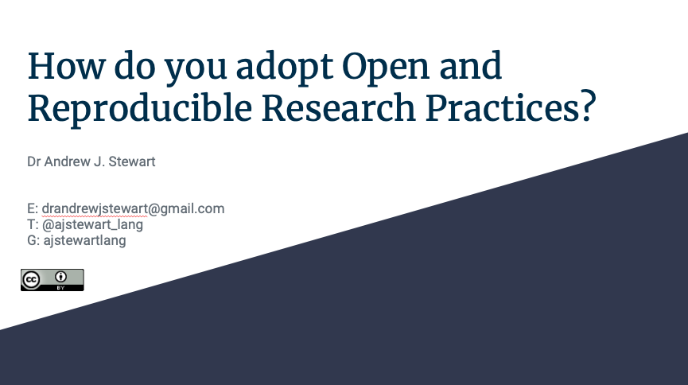

```{r setup, include=FALSE}
knitr::opts_chunk$set(echo = TRUE)
```

# Introduction

Welcome to the Open Research and Reproducibility workshop. Like the other workshops in this series, this one will involve a mix of recorded videos, narrative, and links to various resources for you to explore and to read.  To start with, I'd like you to watch the following recording of my keynote at the [Collaborations Workshop 2020](https://www.software.ac.uk/news/dr-andrew-stewart-open-collaborations-workshop-2020-keynote-open-research) event run by the [Software Sustainability Institute](https://www.software.ac.uk). In the talk, I cover the so-called replication crisis in the biomedical sciences, issues around open research, and summarise some of the initiatives (including the [UK Reproducibility Network](https://www.bristol.ac.uk/psychology/research/ukrn/)) that have been established to address the fundamental problems around open research, transparency, and reproducibility in science.

&nbsp;&nbsp;

<center>

<iframe width="560" height="315" src="https://youtube.com/embed/E1Sd_GEYLoQ" frameborder="0" allowfullscreen></iframe>

</center>

&nbsp;&nbsp;

You can also view and download the slides by clicking on the image below:

&nbsp;&nbsp;

<center>

[{width=75%}](https://docs.google.com/presentation/d/1sj7xd3QFSu0FlKKc5jyQLUGlYpfq9tF-6eB4RnOsv3w/edit?usp=sharing)

</center>

&nbsp;&nbsp;

Once you have watched the video above and/or downloaded the slides, please have a read through the following paper by Ionnidis (2005) which arguably started the conversation around reproducibility that has had such an impact on research in Psychology and across the Biomedical sciences for the last few years. Clicking on the image below will take you to the paper. 

&nbsp;&nbsp;

<center>

[{ width=75% }](https://journals.plos.org/plosmedicine/article?id=10.1371/journal.pmed.0020124)

</center>

&nbsp;&nbsp;

This post by Dorothy Bishop in 2019 nicely captures the situation a number of years later. Clicking on the image below will take you to the paper. 

&nbsp;&nbsp;

<center>

[{width=75% }](https://www.nature.com/articles/d41586-019-01307-2)

</center>

# How to do Reproducible Research

One of the biggest challenges facing researchers who are used to the **old** way of conducting research is that they feel that they don't have the knowledge or technical skills to adopt open and reproducible research practices.  But it's not that hard!  Before you run your experiment, you can pre-register your hypotheses so that when you come to analyse and write-up your results, you can demonstrate that your predictions really were made in advance of data collection.  You can also make your research data open (and FAIR) alongside your code so that others can recreate your analyses.  By adopting open source software such as R, any research findings you produce can be *re*-produced by others who can access your data and code.  This principle of using open tools to allow us to produce open (and reusable) data and code is the fundamental philosophy behind all of the workshops in this unit.  Have a look at the video below where I talk about how we can adopt open and reproducible research practices.  

&nbsp;&nbsp;

<center>

<iframe width="560" height="315" src="https://youtube.com/embed/E1Sd_GEYLoQ" frameborder="0" allowfullscreen></iframe>

</center>

&nbsp;&nbsp;

You can also view and download the slides by clicking on the image below:

&nbsp;&nbsp;

<center>

[{width=75%}](
https://docs.google.com/presentation/d/1WzSk2Ra-OLrMCPTCoQoKoF_utsq_TNu53TxoXEC82Lw/edit?usp=sharing)

</center>

&nbsp;&nbsp;

# Experimental Power

Many experimental studies are under-powered for the effect size of interest.  This comes about simply because the study does not generate a dataset that is sufficiently rich for the planned analyses.  Datasets can be made richer via an increase in the number of observations - this could be by increasing the participant sample size, or by increasing the number of trials each participant is exposed to - or both!  A study that is under-powered results in situations whereby even if the effect is there - waiting to be found - the study is likely to **not** detect it. 

In addition to under-powered studies failing to detect the effects they set out to uncover, when such studies **do** find an effect, the magnitude of that effect size will tend to be an over-estimate - thus misleading researchers about how big the effect is.  Under-powered research is (at best) a waste of resources such as time and money - and (at worst) also misleading/wrong.  Combined with publication bias, under-powered studies can also make us think an effect is present - when actually it is not (i.e., the result is a false positive).  But because journals tend to only want to publish 'significant' results, other researchers will waste more resources trying to replicate/build on an effect that was never real in the first place...

There are many things we can do to make sure our research is appropriately powered for the effect size of interest.  Watch the video below where I talk about these issues and possible solutions.

&nbsp;&nbsp;

<center>

<iframe width="560" height="315" src="https://youtube.com/embed/E1Sd_GEYLoQ" frameborder="0" allowfullscreen></iframe>

</center>

&nbsp;&nbsp;

