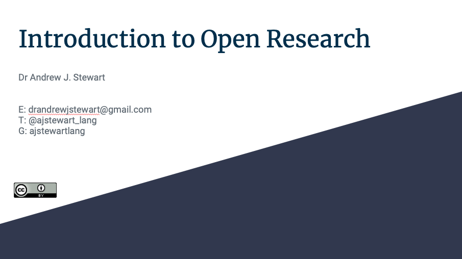
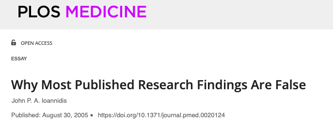
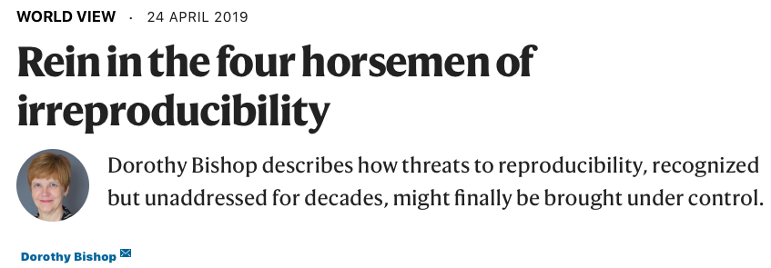

```{r setup, include=FALSE}
knitr::opts_chunk$set(echo = TRUE)
```

# Introduction

Welcome to the Open Research and Reproducibility workshop. Like the other workshops in this series, this one involves a mix of recorded videos, narrative, and links to various resources for you to explore and to read. Here is a brief introduction from myself - you can make the video full screen by clicking on the icon in the bottom right of the image. You can also turn on the subtitles in YouTube. I have recorded the audio using a podcast microphone, so sound quality will be improved if you listen via headphones.

&nbsp;&nbsp;

<center>

<iframe width="560" height="315" src="https://youtube.com/embed/xStz6LOdObM" frameborder="0" allowfullscreen></iframe>

</center>

&nbsp;&nbsp;

# Open Research (A Brief History)

First I'd like you to watch the following video where I describe the history of the replication crisis and the issues which have motivated a move towards the adoption of open and reproducible research practices. I delivered a version of this talk as my keynote at the [Collaborations Workshop 2020](https://www.software.ac.uk/news/dr-andrew-stewart-open-collaborations-workshop-2020-keynote-open-research) event run by the [Software Sustainability Institute](https://www.software.ac.uk). I cover the so-called replication crisis in the biomedical sciences, issues around open research, and summarise some of the initiatives (including the [UK Reproducibility Network](https://www.bristol.ac.uk/psychology/research/ukrn/)) that have been established to address the fundamental problems around open research, transparency, and reproducibility in science.

&nbsp;&nbsp;

<center>

<iframe width="560" height="315" src="https://youtube.com/embed/TRUbHYPRZmg" frameborder="0" allowfullscreen></iframe>

</center>

&nbsp;&nbsp;

## Slides

If you have a Google account, you can also view and download the slides in a range of formats by clicking on the image below. If you don't have a Google account, you can download the slides in .pdf format by [clicking here](../slides/introduction_to_open_research.pdf).

&nbsp;&nbsp;

<center>

[{width=75%}](https://docs.google.com/presentation/d/1UOkWayJ5J7j2Xg1Y05sbkK-iWtlkAVvtalOu4VuEq4c/edit?usp=sharing)

</center>

&nbsp;&nbsp;

Before watching the next video, please have a read through the following paper by Ionnidis (2005) which arguably started the conversation around reproducibility that has had such an impact on research in Psychology and across the Biomedical sciences for the last few years. Clicking on the image below will take you to the paper. 

## Ionnidis (2005)

&nbsp;&nbsp;

<center>

[{ width=75% }](https://journals.plos.org/plosmedicine/article?id=10.1371/journal.pmed.0020124)

</center>

&nbsp;&nbsp;

## Bishop (2019)

This post by Dorothy Bishop in 2019 nicely captures the situation a number of years later. Clicking on the image below will take you to the paper. 

&nbsp;&nbsp;

<center>

[{width=75% }](https://www.nature.com/articles/d41586-019-01307-2)

</center>

# How to do Reproducible Research

One of the biggest challenges facing researchers who are used to the **old** way of conducting research is that they feel that they don't have the knowledge or technical skills to adopt open and reproducible research practices.  But it's not that hard!  Before you run your experiment, you can pre-register your hypotheses so that when you come to analyse and write-up your results, you can demonstrate that your predictions really were made in advance of data collection.  You can also make your research data open (and FAIR) alongside your code so that others can recreate your analyses.  And by posting your research article on a pre-print server (such as [PsyArXiv](https://psyarxiv.com) or [bioRxiv](https://www.biorxiv.org)) before submission to a journal, you make your research findings available to all.  The adoption of open source software such as R, also means that any research findings you produce can be *re*-produced by others who can access your data and code.  This principle of using open tools to allow us to produce open (and reusable) data and code is the fundamental philosophy behind all of the workshops in this unit.  Have a look at the video below where I talk about how we can adopt open and reproducible research practices.

&nbsp;&nbsp;

<center>

<iframe width="560" height="315" src="https://youtube.com/embed/gSAC23PRr2U" frameborder="0" allowfullscreen></iframe>

</center>

&nbsp;&nbsp;

## Slides

You can also view and download the slides in a range of formats by clicking on the image below. If you don't have a Google account, you can download the slides in .pdf format by [clicking here](../slides/adopting_open_practices.pdf).
&nbsp;&nbsp;

<center>

[{width=75%}](
https://docs.google.com/presentation/d/1WzSk2Ra-OLrMCPTCoQoKoF_utsq_TNu53TxoXEC82Lw/edit?usp=sharing)

</center>

&nbsp;&nbsp;

## Crüwell et al. (2019)

Here's a great guide to the various things you can do to make your own research more open. Just click on the image to open the paper.

<center>

[{width=75%}](
https://psycnet.apa.org/fulltext/2019-80290-002.pdf)

</center>

&nbsp;&nbsp;

## Improve this Workshop

If you spot any issues/errors in this workshop, you can raise an issue or create a pull request for [this repo](https://github.com/ajstewartlang/01_open_research_and_reproducibility). 